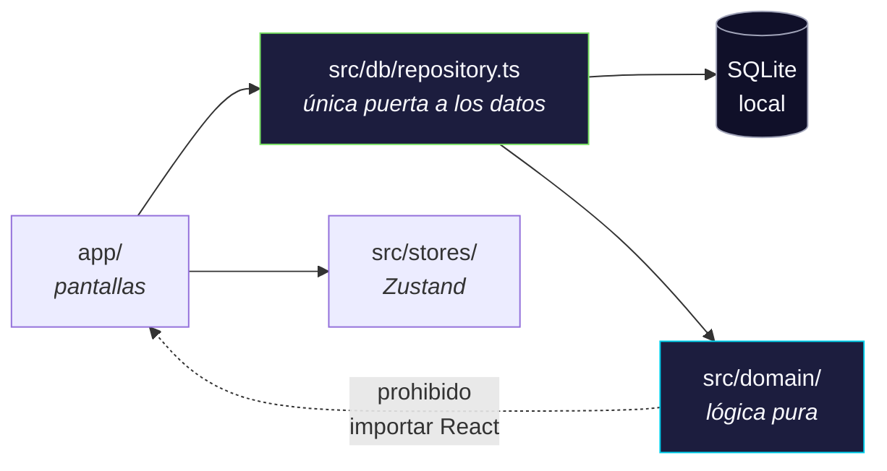

<div align="center">


# Ancla

**Una app de bolsillo para entrenar la memoria con las técnicas de Harry Lorayne,
con repetición espaciada de verdad y una racha que te obliga a volver.**

*Aplicación personal · iOS · 100 % local · sin cuentas, sin nube, sin anuncios*

</div>

---

## La idea en una frase

Las técnicas clásicas de memoria funcionan, pero **se oxidan si no se practican**.
Ancla convierte cuatro de esas técnicas en tarjetas, y deja que un algoritmo de
repetición espaciada decida qué toca repasar cada día — para que practicar sean
diez minutos, no una hora.

El nombre viene de lo que hacen todas estas técnicas: **anclar** algo abstracto
—un número, una carta— a una imagen concreta e imposible de olvidar.

---

## Qué sabe hacer

<table>
<tr>
<td width="50%" valign="top">

### 🪝 Colgadero
100 palabras-percha, una por cada número del 1 al 100. Cada palabra "cuelga" de
un número por su sonido. Es la base de todo lo demás.

</td>
<td width="50%" valign="top">

### 🃏 Naipes
Las 52 cartas de la baraja, cada una con su palabra. Incluye un modo de
**baraja completa**: memorizar el orden de las 52 y reproducirlo contra reloj.

</td>
</tr>
<tr>
<td width="50%" valign="top">

### 🔗 Listas encadenadas
El Sistema de la Cadena: recordar una lista enlazando cada objeto con el
siguiente mediante una imagen absurda. Se practica eslabón por eslabón.

</td>
<td width="50%" valign="top">

### 🔢 Números importantes
Teléfonos, PINs, fechas. La app descompone el número en trozos y te muestra la
cadena de palabras colgadero que lo codifica.

</td>
</tr>
</table>

Y encima de las cuatro: **racha diaria**, **panel de retención** para ver qué se
te está olvidando, y **creación de ejercicios propios**.

---

## El truco de fondo: el alfabeto fonético

Todo el sistema se apoya en una idea vieja y elegante — **cada dígito tiene un
sonido consonante asignado**. Las vocales no valen nada, así que sirven de
relleno libre para formar palabras.

| Dígito | Sonido(s) | Por qué |
|:---:|---|---|
| **1** | T, D | La T tiene un palo vertical |
| **2** | N, Ñ | La N tiene dos palos |
| **3** | M | La M tiene tres palos |
| **4** | C (ca, co, cu), K, Q | **C** es inicial de "cuatro" |
| **5** | L, LL | L es el 50 romano |
| **6** | S, Z, C (ce, ci) | **S** es inicial y final de "seis" |
| **7** | F, J, G (ge, gi) | Una F invertida parece un 7 |
| **8** | Ch, G (ga, go, gu) | La Ch tiene la forma cerrada del 8 |
| **9** | V, B, P | Una P invertida parece un 9 |
| **0** | R, RR | El cero es redondo como una rueda |

> Las vocales y la **H, W, X, Y** no tienen valor numérico.

<details>
<summary><b>Veámoslo funcionar →</b></summary>

<br>

Tomemos la palabra colgadero del número **14**, que en esta app es **«Taco»**:

```
T  a  c  o
│     │
│     └── C (ante "o") → 4
└──────── T            → 1

          = 14  ✓
```

Y al revés: para memorizar el teléfono **300 123 4567**, la app lo parte en
trozos y te da la cadena de imágenes que lo codifica. Ya no memorizas diez
dígitos sueltos — memorizas una historieta corta.

El decodificador está implementado como lógica pura y probado exhaustivamente:
maneja dígrafos (`ch`, `ll`, `rr`, `qu`, `gu`), las C y G que cambian de sonido
según la vocal que sigue, y las tildes.

</details>

---

## Por qué repetición espaciada, y no "repasar cuando me acuerde"

Repasar todo todos los días es insostenible. Repasar al azar es ineficaz. La
respuesta conocida es **espaciar** los repasos: revisar cada tarjeta justo
cuando estás a punto de olvidarla.

Ancla usa **FSRS** (*Free Spaced Repetition Scheduler*), un algoritmo moderno que
modela por separado la **dificultad** de cada tarjeta y su **estabilidad** en tu
memoria. Al calificar una tarjeta con uno de cuatro niveles —Otra vez, Difícil,
Bien, Fácil— recalcula cuándo debe volver a aparecer.

> [!NOTE]
> Todo el scheduling pasa por un único módulo envoltorio (`src/domain/fsrs/`).
> En ningún otro lugar del código se hace aritmética de fechas ni se fija a mano
> una fecha de repaso. Es una regla dura del proyecto, y es lo que evita que el
> algoritmo se corrompa por un atajo puntual.

---

## Recorrido por la app

| Pantalla | Para qué |
|---|---|
| **Inicio** | «¿Qué hago hoy?» en menos de dos segundos: racha, meta del día, elementos por categoría y un botón grande de practicar |
| **Practicar** | Sesión mixta que reparte entre las cuatro categorías, priorizando lo vencido |
| **Racha** | Llama animada, heatmap de 90 días estilo GitHub, y congeladores para salvar un día perdido |
| **Estadísticas** | Panel de retención por categoría y ventana temporal, más las tarjetas que peor se te dan |
| **Ajustes** | Estilo visual, tipografía, meta diaria, recordatorio y congeladores |

Cada categoría tiene además sus propios modos de práctica: **Fonética Flash**
(número → palabra), **Reverso** (palabra → número), y **Velocidad** (serie
cronometrada con autoevaluación rápida).

---

## Dos estilos visuales

La app trae dos direcciones completas, intercambiables en vivo desde Ajustes:

| | **Arcade Neón** | **Papel y Tinta** |
|---|---|---|
| Ánimo | Gamificado, tipo Duolingo | Cuaderno de apuntes, editorial |
| Formas | Píldoras, esquinas redondas, sombras marcadas | Bordes finos, esquinas rectas, sin sombra |
| Tipografía | Fredoka + Nunito | Lora + Karla |
| Paleta | Índigo profundo con cian, magenta y verde | Tierra cálida con terracota y oliva |

No cambian solo los colores: cambian las **recetas de forma** de cada componente.
Los diseños originales están en `agent_docs/prototipos/` como HTML autocontenido
— se abren en cualquier navegador, sin instalar nada.

---

## Cómo correrlo

```bash
npm install          # instalar dependencias
npx expo start       # arrancar; escanear el QR con Expo Go en el iPhone
```

Otros comandos útiles:

```bash
npm test             # 369 tests
npx tsc --noEmit     # comprobar tipos
```

> [!IMPORTANT]
> La app corre en **Expo Go**, lo que significa que necesita el servidor de
> desarrollo encendido para abrirse. Ver [Limitación conocida](#limitación-conocida-la-instalación)
> más abajo.

---

## Cómo está construida

**Stack fijo** (nada se sustituye sin dejar constancia escrita del porqué):

| Capa | Tecnología |
|---|---|
| Framework | Expo SDK 54 + React Native 0.81 |
| Lenguaje | TypeScript, `strict: true` |
| Almacenamiento | `expo-sqlite` — 100 % local en el dispositivo |
| Repetición espaciada | `ts-fsrs` |
| Navegación | `expo-router` (basada en archivos) |
| Estado | Zustand |
| Tests | Jest |

**Cinco directorios y cuatro reglas duras.** La arquitectura cabe en una regla:
*los datos entran por un solo sitio, la lógica no sabe que existe React, y la UI
no sabe que existe SQL.*



1. **Todo acceso a datos pasa por `repository.ts`.** Ni una query suelta en una
   pantalla.
2. **Todo scheduling pasa por `scheduler.ts`.** Nunca aritmética de fechas fuera
   de ahí.
3. **`src/domain/` es lógica pura** — prohibido importar React o `expo-*`. Es lo
   que permite probar fonética y FSRS con Jest sin montar el entorno nativo.
4. **La interfaz, en español (Colombia)** — y los nombres de dominio también lo
   están en el código.

Ambas convenciones mecánicas (1 y 3) se comprueban con un `grep` antes de cada
commit. No son una aspiración: o salen vacías, o no hay commit.

---

## Calidad

| | |
|---|---|
| **369 tests** en 15 suites | Jest, corren en ~1.5 s |
| **TDD obligatorio** | En `src/domain/{fsrs,fonetica,racha,numeros,cadena}`: primero el test, verlo fallar, luego el código |
| **7 migraciones** | Todas aditivas. Prohibido `DROP`, borrado masivo o cambio de tipo sin autorización explícita |
| **28 decisiones registradas** | Cada decisión cara de revertir queda documentada en `agent_docs/DECISIONS.md`, con su porqué |

Las migraciones se prueban siempre **sobre una base de datos con datos de la
versión anterior**, no sobre una vacía — porque el riesgo real no es que falle
en limpio, sino que se lleve por delante los datos que ya viven en el teléfono.

---

## Cómo se construyó

El proyecto se desarrolló con Claude Code siguiendo un método fijo, fase por
fase: **explorar → planear → implementar → verificar → registrar**.

La regla que sostuvo todo: **ninguna fase se daba por cerrada sin correrla en un
iPhone real.** Ni tests en verde, ni "compila bien", ni "debería funcionar".
Abrir la app y usarla.

| Fase | Qué entregó | Commit |
|:---:|---|:---|
| 0 | Scaffold Expo + TypeScript strict | `c157ae4` |
| 1 | Motor FSRS + esquema SQLite + repositorio | `5999dbe` |
| 2 | Colgadero: decodificador fonético, 100 palabras, 3 modos | `57f68d4` |
| 3 | Naipes: validador, barajado, 52 cartas, 5 pantallas | `28f583e` |
| 4 | Listas encadenadas + Números importantes | `0e909c4` |
| 5 | Racha y Dashboard | `043337c` |
| 6 | Panel de retención | `d980f76` |
| 7 | Ejercicios personalizados | `a76bccf` |
| 8 | Pulido visual e identidad — *parcial* | *este commit* |

<details>
<summary><b>Tres decisiones con historia →</b></summary>

<br>

**Bajar de Expo SDK 57 a 54, a propósito.** El scaffold inicial usó la última
versión publicada. Al probar en el teléfono, no cargaba: Expo Go del App Store
todavía no soportaba la SDK 57. Lección registrada como regla permanente —
"más nueva" no significa "usable", y hay que verificar contra el App Store antes
de subir de versión.

**`expo-sqlite` no corre bajo Jest.** Descubierto al escribir los primeros tests
del repositorio. En vez de mockear la librería (frágil y engañoso), se definió
una interfaz propia de conexión y un adaptador sobre el `node:sqlite` nativo de
Node. Los tests corren contra SQLite **de verdad**, no contra un doble.

**Three.js descartado para voltear una carta.** Se evaluó en serio y se rechazó
por un riesgo concreto: Apple deprecó OpenGL, y hay reportes del puente
`expo-gl` fallando en iPhones modernos. Un riesgo de "no carga en tu teléfono"
no es aceptable por una animación. Se hizo con la API `Animated` nativa… y al
final el propio diseño mostró algo mejor: carta y palabra lado a lado, sin
volteo.

**Bonus — un bug que enseñó a desconfiar de la explicación cómoda.** Las cartas
de naipes monopolizaban la sesión diaria. La primera explicación (muchos fallos
acumulados) era plausible y resultó **falsa**: al exportar la base de datos real
del teléfono y consultarla con SQL, los fallos eran exactamente cero. La causa
real era otra. La corrección quedó registrada aparte, sin borrar la explicación
equivocada — el registro también sirve para recordar en qué se creyó y por qué.

</details>

---

## Estado actual

> [!WARNING]
> **El proyecto está detenido.** Las fases 0 a 7 están terminadas y verificadas
> en dispositivo. La fase 8 (pulido visual) quedó **a medias**.

**Funciona y está probado:** las cuatro técnicas completas, repetición espaciada,
racha, panel de retención y creación de ejercicios propios.

**Construido pero sin probar en el teléfono:** todo el trabajo visual de la fase
8 — los dos estilos, los íconos, el rediseño de naipes, el heatmap, la identidad.

**Sin construir:** las notificaciones (que eran el criterio formal de cierre de
la fase 8), y quedan 24 archivos con colores fijos que aún ignoran el selector
de estilo.

**Bug conocido:** los botones "Bien" y "Fácil" no aparecen en dos de las
pantallas de práctica. Diagnóstico y siguientes pasos en `SESSION_NOTES.md`.

---

## Limitación conocida: la instalación

Ancla corre en **Expo Go**, lo que obliga a tener el servidor de desarrollo
encendido cada vez. Para tenerla como una app normal en la pantalla de inicio,
Apple solo ofrece dos caminos:

| | Costo | Caducidad |
|---|:---:|---|
| Apple ID gratis + Xcode | **US$0** | El perfil caduca a los **7 días**; hay que reinstalar desde el Mac con cable |
| Apple Developer Program | **US$99/año** | 12 meses, instalación por aire |

**No existe una opción gratuita y permanente.** Todo camino sin caducidad pasa
por una identidad de firma que solo emite el programa de pago. Es la razón por
la que el proyecto se detuvo aquí — no un obstáculo técnico.

La parte buena: una compilación de *release* **ya empaqueta el código**, así que
por cualquiera de los dos caminos la app abriría sin servidor.

---

## Mapa del repositorio

```
app/          Pantallas (expo-router). Solo UI y navegación.
src/
  db/         Repositorio, migraciones, tipos. Único sitio que toca SQLite.
  domain/     Lógica pura: fonética, FSRS, racha, cadena, números.
  components/ Componentes de UI reutilizables.
  stores/     Estado de UI (Zustand).
  tema/       Tokens de color y tipografía.
  seed/       Datos semilla: las 100 palabras y las 52 cartas.
assets/       Ícono y splash.
agent_docs/   Especificaciones, decisiones y prototipos.
```

### Dónde seguir leyendo

| Si buscas… | Ve a |
|---|---|
| El estado exacto y qué hacer al retomar | `SESSION_NOTES.md` |
| Por qué algo se hizo de cierta forma | `agent_docs/DECISIONS.md` |
| El esquema de la base de datos | `agent_docs/MODELO-DATOS.md` |
| Las reglas del alfabeto fonético | `agent_docs/decodificacion-fonetica.md` |
| Los diseños visuales | `agent_docs/prototipos/` |
| La especificación completa | `PROJECT_BRIEF.md` |

> Esos archivos están escritos para que un agente de IA pueda retomar el trabajo
> con precisión. Este README es la puerta de entrada humana.

---

## Créditos y reconocimiento

Este proyecto existe gracias al trabajo de **Harry Lorayne** (con Jerry Lucas),
cuyo libro *Cómo adquirir una supermemoria* (*The Memory Book*) sistematizó las
técnicas que aquí se practican:

- **Sistema del Colgadero** (peg system) y sus 100 palabras ancla
- **Alfabeto Fonético** para números
- **Sistema de naipes** para memorizar barajas
- **Sistema de la Cadena** (listas encadenadas)

Ancla es una herramienta de práctica personal, sin fines comerciales, basada en
esas técnicas. La selección, adaptación al español, las 100 palabras colgadero
en colombiano, el contenido de naipes, el software y su diseño son obra del
autor de este repositorio. El algoritmo de repetición espaciada usa
[**FSRS**](https://github.com/open-spaced-repetition/fsrs4anki) (open-spaced-repetition),
implementado vía [`ts-fsrs`](https://github.com/open-spaced-repetition/ts-fsrs).

- 📖 Libro original: Harry Lorayne & Jerry Lucas, *The Memory Book* (1974);
  ed. en español *Cómo adquirir una supermemoria*.
- Este proyecto no está afiliado ni respaldado por los autores ni herederos
  de la obra; es un homenaje de un lector agradecido.

---

<div align="center">
<sub>Proyecto personal. Las técnicas de memoria son de Harry Lorayne;<br>
las 100 palabras colgadero y las 52 de naipes son del autor de este repositorio.</sub>
</div>
